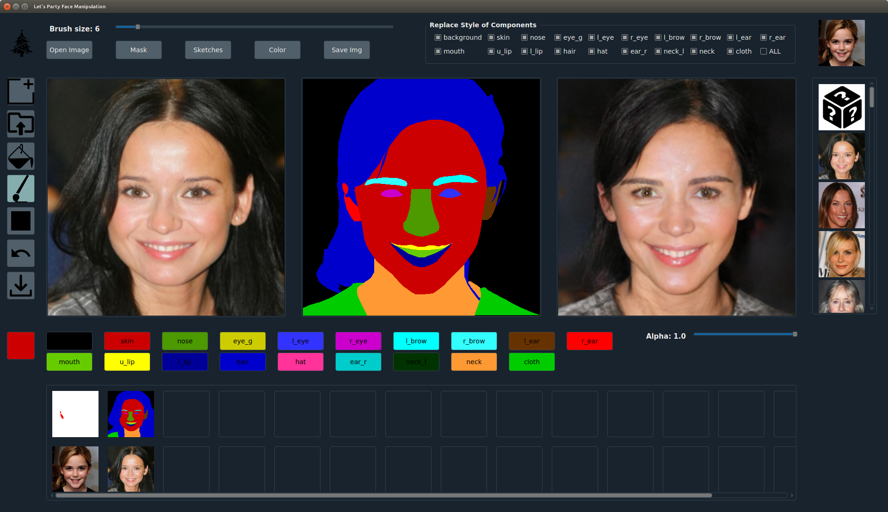

# SEAN: Image Synthesis with Semantic Region-Adaptive Normalization (CVPR 2020 Oral)


**Figure:** *Face image editing controlled via style images and segmentation masks with SEAN*

We propose semantic region-adaptive normalization (SEAN), a simple but effective building block for Generative Adversarial Networks conditioned on segmentation masks that describe the semantic regions in the desired output image. Using SEAN normalization, we can build a network architecture that can control the style of each semantic region individually, e.g., we can specify one style reference image per region. SEAN is better suited to encode, transfer, and synthesize style than the best previous method in terms of reconstruction quality, variability, and visual quality. We evaluate SEAN on multiple datasets and report better quantitative metrics (e.g. FID, PSNR) than the current state of the art. SEAN also pushes the frontier of interactive image editing. We can interactively edit images by changing segmentation masks or the style for any given region. We can also interpolate styles from two reference images per region.

> **SEAN: Image Synthesis with Semantic Region-Adaptive Normalization** <br>
> Peihao Zhu, Rameen Abdal, Yipeng Qin, Peter Wonka <br>
> *Computer Vision and Pattern Recognition **CVPR 2020, Oral***


[[Paper](https://arxiv.org/pdf/1911.12861.pdf)]
[[Project Page](https://zpdesu.github.io/SEAN/)]
[[Demo](https://youtu.be/0Vbj9xFgoUw)]


## Installation

Clone this repo.
```bash
git clone https://github.com/ZPdesu/SEAN.git
cd SEAN/
```

This code requires PyTorch, python 3+ and Pyqt5. Please install dependencies by
```bash
pip install -r requirements.txt
```

This model requires a lot of memory and time to train. To speed up the training, we recommend using 4 V100 GPUs


## Dataset Preparation

This code uses [CelebA-HQ](https://github.com/tkarras/progressive_growing_of_gans) and [CelebAMask-HQ](https://github.com/switchablenorms/CelebAMask-HQ) dataset. The prepared dataset can be directly downloaded [here](https://drive.google.com/file/d/1TKhN9kDvJEcpbIarwsd1_fsTR2vGx6LC/view?usp=sharing). After unzipping, put the entire CelebA-HQ folder in the datasets folder. The complete directory should look like `./datasets/CelebA-HQ/train/` and `./datasets/CelebA-HQ/test/`.


## Generating Images Using Pretrained Models

Once the dataset is prepared, the reconstruction results be got using pretrained models.


1. Create `./checkpoints/` in the main folder and download the tar of the pretrained models from the [Google Drive Folder](https://drive.google.com/file/d/1UMgKGdVqlulfgOBV4Z0ajEwPdgt3_EDK/view?usp=sharing). Save the tar in `./checkpoints/`, then run

    ```
    cd checkpoints
    tar CelebA-HQ_pretrained.tar.gz
    cd ../
    ```

2. Generate the reconstruction results using the pretrained model.
	```bash
   python test.py --name CelebA-HQ_pretrained --load_size 256 --crop_size 256 --dataset_mode custom --label_dir datasets/CelebA-HQ/test/labels --image_dir datasets/CelebA-HQ/test/images --label_nc 19 --no_instance --gpu_ids 0
    ```

3. The reconstruction images are saved at `./results/CelebA-HQ_pretrained/` and the corresponding style codes are stored at `./styles_test/style_codes/`.

4. Pre-calculate the mean style codes for the UI mode. The mean style codes can be found at `./styles_test/mean_style_code/`.

	```bash
    python calculate_mean_style_code.py
    ```


## Training New Models

To train the new model, you need to specify the option `--dataset_mode custom`, along with `--label_dir [path_to_labels] --image_dir [path_to_images]`. You also need to specify options such as `--label_nc` for the number of label classes in the dataset, and `--no_instance` to denote the dataset doesn't have instance maps.


```bash
python train.py --name [experiment_name] --load_size 256 --crop_size 256 --dataset_mode custom --label_dir datasets/CelebA-HQ/train/labels --image_dir datasets/CelebA-HQ/train/images --label_nc 19 --no_instance --batchSize 32 --gpu_ids 0,1,2,3
```

If you only have single GPU with small memory, please use `--batchSize 2 --gpu_ids 0`.


## UI Introduction

We provide a convenient UI for the users to do some extension works. To run the UI mode, you need to:

1. run the step **Generating Images Using Pretrained Models** to save the style codes of the test images and the mean style codes. Or you can directly download the style codes from [here](https://drive.google.com/file/d/153U5q_CfwPM0V4wRP199BhD9niUuVW95/view?usp=sharing). (Note: if you directly use the downloaded style codes, you have to use the pretrained model.

2. Put the visualization images of the labels used for generating in `./imgs/colormaps/` and the style images in `./imgs/style_imgs_test/`. Some example images are provided in these 2 folders. Note: the visualization image and the style image should be picked from `./datasets/CelebAMask-HQ/test/vis/` and `./datasets/CelebAMask-HQ/test/labels/`, because only the style codes of the test images are saved in `./styles_test/style_codes/`. If you want to use your own images, please prepare the images, labels and visualization of the labels in `./datasets/CelebAMask-HQ/test/` with the same format, and calculate the corresponding style codes.

3. Run the UI mode

    ```bash
    python run_UI.py --name CelebA-HQ_pretrained --load_size 256 --crop_size 256 --dataset_mode custom --label_dir datasets/CelebA-HQ/test/labels --image_dir datasets/CelebA-HQ/test/images --label_nc 19 --no_instance --gpu_ids 0
    ```
4. How to use the UI. Please check the detail usage of the UI from our [Video](https://youtu.be/0Vbj9xFgoUw).

	[](https://youtu.be/0Vbj9xFgoUw)

## Other Datasets
Will be released soon.

## License

All rights reserved. Licensed under the [CC BY-NC-SA 4.0](https://creativecommons.org/licenses/by-nc-sa/4.0/legalcode) (**Attribution-NonCommercial-ShareAlike 4.0 International**) The code is released for academic research use only.

## Citation
If you use this code for your research, please cite our papers.
```
@InProceedings{Zhu_2020_CVPR,
author = {Zhu, Peihao and Abdal, Rameen and Qin, Yipeng and Wonka, Peter},
title = {SEAN: Image Synthesis With Semantic Region-Adaptive Normalization},
booktitle = {IEEE/CVF Conference on Computer Vision and Pattern Recognition (CVPR)},
month = {June},
year = {2020}
}
```

## Acknowledgments
A face generation, which can change the appearance of an existing person through face generation. It can be used for plastic surgery, and some appearance analysis is mainly used for criminals, and infers the suspect of fugitive by recognizing his son’s face. people. It can also be used for abducting and trafficking children in the early years. Through the appearance of the parents of the child, the app can be used to infer the current appearance of the child and be identified from big data.
Code borrows heavily from SEAN [ZPdesu](https://zpdesu.github.io/SEAN/)
